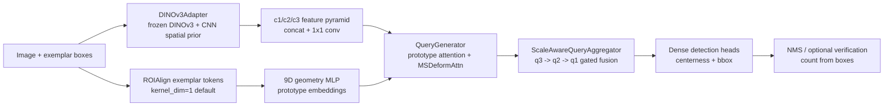
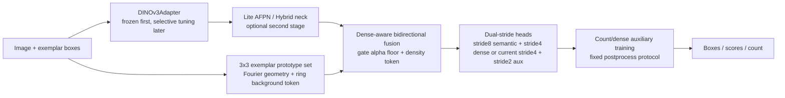

# 第六版代码修改建议、Loss 归档与路线图执行计划

更新时间：2026-06-25

依据文件：

- `C:/Users/myy/Downloads/DINO-SAM-GECO2_6 超越 GECO2 的改进路线图.pdf`
- `D:/ScientificResearch/DINO-SAM-GECO2_6`
- `D:/ScientificResearch/DINO-SAM-GECO2_6/scripts/run_clean_p3a_linux.sh`

本文用于把路线图 PDF、当前代码实装状态、服务器当前运行参数和下一轮代码修改计划统一到同一份可执行文档中。没有完整消融支撑的内容只写为“预期收益”或“待验证”，不当作已验证结论。

## 总结结论

当前项目的主要短板不是 DINOv3 backbone 语义不够强，而是高密度场景下候选召回不足。历史结果已经出现了典型错位：`query_output_stride=8 + semantic anchor` 能提升 `F1@IoU50/AP50`，但会明显拉高 RMSE，说明模型更会挑框，却没有更稳地数数。

当前最可信的计数基线仍是 P3 sweep：`MAE/RMSE = 21.16 / 48.83`，`F1@IoU50 = 0.496`，`AP50 = 0.351`。P3-A/stride8/semantic 混合分支已有结果为 `MAE/RMSE = 20.90 / 63.61`，`F1@IoU50 = 0.523`，`AP50 = 0.382`。因此下一轮不能继续用混合结果证明 semantic anchor 或 stride8 有利，必须拆成 clean P3-A、stride/refinement、center loss、prototype/fusion 的独立消融。

路线图 PDF 的主线可以压缩成一句话：先把 dense recall 修回来，再把 exemplar 表示做厚，最后再谈更大 backbone。对应到当前代码，优先级应是：

1. 固定当前 clean P3-A 运行协议，验证 `stride4 + stride2_refinement + center gaussian + semantic anchor` 是否真的优于 P3。
2. 对 `ScaleFusionBlock` 增加 gate 残差下限和诊断日志，避免 dense regime 下高层语义被 gate 过度压制。
3. 把 `kernel_dim=1` 的 collapsed prototype 升级为 `kernel_dim=3` 多 token prototype，并补 ring ROI background token 与 target-background loss。
4. 再加入 count consistency / dense positive auxiliary supervision，而不是恢复 density map 主监督。
5. AFPN/A3-FPN、selective DINO tuning、teacher distillation 和更大 DINOv3 只放在第二阶段。

## 当前网络结构与路线图目标

当前主链路：



路线图推荐目标形态：



注意：当前代码已经有很多第六版组件，但路线图里几个最关键的增强还没有真正闭环：

- 已有 `use_background_token` 是 mutual adapter 里的 learnable background token，不等同于 ring ROI background negative。
- 已有 `num_prototypes=4` 是对 prototype/memory 做 pooling/blending，不等同于保留 exemplar 空间结构的 3x3 prototype set。
- 已有 `stride2_refinement=True` 是 stride4 主分支后的 aux/refine 分支，不等同于路线图里的 `stride8 semantic + stride4 dense` 双头融合。
- 已有 `center_gaussian_loss` 是中心热图辅助监督，不等同于 count consistency 或 dense positive O2O/O2M supervision。

## 当前 Loss 计算归档

当前项目是 detection-based few-shot counting，不是 density/count loss 主线。训练时先用 Hungarian matching 将 dense candidate boxes 和 GT boxes 配对，再反传 bbox L1、GIoU、quality focal centerness/objectness、aux refinement 分支，以及可选 gaussian center heatmap loss。后处理后的预测数量只用于 MAE/RMSE、日志和 checkpoint 选择，不参与反传。

### 总体公式

`train.py::compute_detection_batch_loss()` 对每张图像单独构造 GT：

```text
target_bboxes = valid(gt_bboxes) / image_size
labels = zeros(num_gt)
```

然后分别计算主分支和 refinement/aux 分支：

```text
main = SetCriterion(outputs, target, centerness, ref_points)
aux  = SetCriterion(refine_outputs, target, refine_centerness, refine_ref_points)

total_loss =
    main.loss_total
  + aux_loss_coef * aux.loss_total
  + center_gaussian_loss_coef * center_gaussian_loss
```

`SetCriterion.loss_total` 的权重来自 `train.py::build_weight_dict()`：

```text
loss_total =
    ce_loss_coef   * loss_ce
  + bbox_loss_coef * loss_bbox
  + giou_loss_coef * loss_giou
```

当前默认权重：

```text
ce_loss_coef = 2.0
bbox_loss_coef = 1.0
giou_loss_coef = 2.0
aux_loss_coef = 0.5
center_gaussian_loss_coef = 1.0
cost_class = 2.0
cost_bbox = 1.0
cost_giou = 2.0
focal_alpha = 0.5
```

### Hungarian Matching

`src/models/matcher.py::PointLossHungarianMatcher` 使用三项代价：

```text
C = cost_class * (-sigmoid(box_v))
  + cost_bbox  * L1(pred_box, gt_box)
  + cost_giou  * (-GIoU(pred_box, gt_box))
```

新逻辑 `_fallback_match_zero_iou_gt()` 会对完全没有 IoU 命中的 GT 使用最近中心预测作为 fallback match。这个改动的直接目标是让 zero-IoU GT 也能获得 bbox regression 梯度，而不是只靠中心点监督。

### Quality Focal Centerness Loss

`src/utils/losses.py::ce_loss()` 使用 soft target focal BCE：

```text
prob = sigmoid(logit)
loss_ce = BCEWithLogits(logit, target) * abs(target - prob)^gamma
```

centerness target 构造规则：

```text
matched TP location: target = matched IoU
FP location: target = 0
FN GT center: target = 1
all GT center neighborhood: center = 1, neighbor = 0.5
```

因此 `loss_ce` 不是普通类别交叉熵，而是 objectness/quality 排序监督。它鼓励 GT 中心附近响应，同时压低未匹配候选。

### Gaussian Center Loss

如果 `center_gaussian_head=True` 且 `center_gaussian_loss_coef > 0`，`center_heatmap_head(refinement_f)` 会额外学习 GT 中心高斯图：

```text
target = max Gaussian around every GT center
loss_center_gaussian = mean((sigmoid(pred) - target)^2 * (1 + 4 * target))
```

它有利于 missed GT 的中心召回，但会增加显存，并可能在密集图像中抬高低质量候选响应。

### 当前没有的 Loss

```text
没有 density-map MSE/L1 主监督
没有 count MAE/RMSE 直接 loss
没有 count consistency soft-count loss
没有 ring-background contrastive / TBD loss
没有直接优化 NMS 后数量的 loss
没有 mask/dice loss
```

`num_objects_pred` 来自 `filter_detections()` 和 optional verification，只用于日志和评估，不反传。

## 当前代码实装状态

| 模块 | 当前代码状态 | 与路线图差距 | 建议 |
|---|---|---|---|
| Backbone | `DINOv3Adapter` 冻结 DINOv3，叠加 CNN spatial prior；adapter 参数用 `backbone_lr` 训练 | 没有 selective unfreeze / LoRA / teacher distill | 保持 frozen，先不换大 backbone |
| Neck/FPN | DINO token 与 CNN prior concat 后 1x1 conv，输出 c1/c2/c3 | 没有 AFPN-Lite、A3-FPN 或 Hybrid Encoder | 第二阶段再做，别抢 P0/P1 资源 |
| Mutual adapter | `MutualAwareTokenAdapter` 已做 image/exemplar token 双向 attention，并可加 learnable bg token | bg token 不是 ring ROI 负样本，没有 TBD loss | 保留开关；ring ROI 单独实现 |
| Prototype | ROIAlign + 9D geometry；默认 `kernel_dim=1`，脚本仍为 1 | exemplar 空间结构仍被压缩；没有 3x3 prototype encoder | 第一轮可先跑 `KERNEL_DIM=3` no-code ablation，再补 self-attn/pooling |
| Prototype memory | `_episode_memory_prototypes()` 从图像 top-k token 取 episode memory，并在 aggregator 里 blend | 不是跨 episode memory bank；可能引入噪声 | 暂保留，记录 `num_prototypes=1/4` 消融 |
| Query fusion | `q3 -> q2 -> q1`，`ScaleFusionBlock` 用 spatial gate + channel gate | 没有 `alpha_min` 残差下限、density token、bottom-up 修正 | 下一轮最小代码改动优先做 gate-rescue |
| Output stride | 支持 `query_output_stride=2/4/8`；当前 clean P3-A 脚本为 4，另有 stride2 refine | 路线图的 stride8 semantic + stride4 dense 双头融合尚未实现 | 当前先验证 stride4+stride2；之后再决定是否做真正双头 |
| Center supervision | `center_gaussian_head/loss` 已实现 | 不是 dense positive O2O/O2M，也不约束总数 | 作为消融项，不要直接当最终方案 |
| Decoupled heads | semantic/context 与 geometry/context 分开注入 class/bbox head | 缺 support-conditioned bbox prior | 保留，第二阶段尝试 geometry prior |
| Verification | `none/exemplar_geometry/feature_similarity` 已有；sweep 支持 soft/sparse_hard | 历史 best 仍是 `verification=none` | 默认继续 none，只在固定 checkpoint 后低阈值 sweep |
| Diagnostics | `summary_by_count_bin.csv`、candidate diagnostics、eval/sweep 工具已有 | 缺 gate alpha、prototype margin、pre/post NMS per-GT 的常规化记录 | P0 必补日志，否则无法判断 gate/prototype 改动 |
| COCO warm-up | `tools/train_coco_adapter.py`、`adapter_checkpoint.py` 已有 | `train.py/arg_parser.py` 还没有 `--adapter-pretrained-checkpoint` 闭环 | 放 E4，主线稳定后再接 |

## 当前服务器运行参数分析

`scripts/run_clean_p3a_linux.sh` 当前默认参数代表的是 clean P3-A 方向，而不是之前导致 RMSE 退化的 stride8 混合分支。关键默认值如下：

```text
RUN_NAME = p3a_clean_semantic_anchor
IMAGE_SIZE = 1024
BATCH_SIZE = 2
GRAD_ACCUM_STEPS = 1
QUERY_OUTPUT_STRIDE = 4
STRIDE2_REFINEMENT = 1
CENTER_GAUSSIAN_HEAD = 1
CENTER_GAUSSIAN_LOSS_COEF = 1.0
NUM_PROTOTYPES = 4
PROTOTYPE_PRED_TOPK = 32
PROTOTYPE_PRED_SCORE_THRESHOLD = 0.5
PROTOTYPE_EMA_MOMENTUM = 0.9
MUTUAL_ADAPTER_LAYERS = 1
BACKGROUND_TOKEN = 1
DECOUPLED_HEADS = 1
KERNEL_DIM = 1
use_semantic_anchor = true
verification_mode = none
nms_method = hard
nms_iou = 0.30
score_threshold = 0.20
score_ratio = 0.50
pre_nms_topk = 4096
max_detections = 4096
```

这个运行参数的优点：

- 与路线图第一优先级一致：从 stride8 回到更密的 stride4 主输出。
- 保留了 stride2 refinement 和 gaussian center，有机会改善小目标/高密度漏检。
- 默认 `verification=none` 是正确的，因为历史验证器 hard threshold 容易过度过滤。
- 使用 hard NMS 0.30 与 P3 best sweep 口径接近，便于和 P3 做公平比较。

主要风险：

- `BATCH_SIZE=2 + stride2_refinement=True + center_heatmap` 按 fp32 估计峰值约 `28-36GB`，24GB 卡容易 OOM。
- `KERNEL_DIM=1` 仍是 collapsed prototype，尚未执行路线图最重要的“保留 exemplar 空间结构”。
- `BACKGROUND_TOKEN=1` 不是 ring ROI negative；不能把它当作 target-background discrimination 已完成。
- `pre_nms_topk/max_detections=4096` 对普通 FSC147 足够，但在 `>300` count bin 上应额外 sweep 8192/16000，确认不是候选 cap 造成欠检。
- 当前脚本一次打开了 semantic anchor、stride2、center loss、prototype memory、background token、decoupled heads，若结果变好或变差，都不能直接归因到单一模块。

建议当前服务器任务先不要中断。等它完成后，优先评估以下 checkpoint：

```text
best_val_rmse
best_val_mae
best_val_gated_rmse
best_val_f1_iou50
best_val_ap50_iou50
best_val_loss
```

必须输出并比较：

```text
summary.json
summary_by_count_bin.csv
top_abs_errors.csv
per_image_predictions.jsonl
coco_metrics.json
selection_report.json
```

验收标准：

```text
1. MAE/RMSE 至少不能明显差于 P3 baseline 21.16/48.83。
2. F1@IoU50/AP50 应不低于 P3 baseline 0.496/0.351。
3. >300 bin 的 signed error 和 pre_nms_per_gt 必须改善或至少不恶化。
4. 若 F1/AP 上升但 RMSE 继续到 60+，该分支只能算 detection-best，不能算 counting-best。
```

## 已有结果对比

### P3 计数基线

`sweep_outputs/p3_20260608_verification_sweep_fix_compat/summary.json`：

```text
score_threshold = 0.25
score_ratio = 0.5
nms_iou = 0.3
nms_method = hard
verification_mode = none

MAE/RMSE = 21.16 / 48.83
signed_error = -1.49
F1@IoU50 = 0.496
AP50 = 0.351
```

count-bin 仍有双向失衡：

```text
7-20:    signed_error = +7.89
20-50:   signed_error = +4.41
50-100:  signed_error = +0.77
100-300: signed_error = -25.24
>300:    signed_error = -101.27
```

### P3-A/stride8/semantic 混合分支

`eval_runs/p3a_20260620_stride8_semantic/best_val_rmse_sweep_core12/summary.json`：

```text
score_threshold = 0.2
score_ratio = 0.5
nms_iou = 0.3
nms_method = hard
verification_mode = none

MAE/RMSE = 20.90 / 63.61
signed_error = -8.93
F1@IoU50 = 0.523
AP50 = 0.382
```

相对 P3：

```text
MAE: 21.16 -> 20.90, 约 1.2% 改善
RMSE: 48.83 -> 63.61, 约 30.3% 变差
F1@IoU50: 0.496 -> 0.523, 约 5.6% 改善
AP50: 0.351 -> 0.382, 约 8.8% 改善
```

结论：该分支可能提升定位质量，但明显损伤 count stability。不能把 semantic anchor、stride8、center loss 或新后处理任一项单独宣称为已验证计数收益。

### Checkpoint 选择

`loss_checkpoint_analysis.md` 记录 count-best 和 loss-best 不是同一 epoch：

```text
best loss: epoch 57, val_loss=0.8286, val_mae=20.8476, val_rmse=51.0233
best MAE/RMSE: epoch 47, val_loss=0.8444, val_mae=20.7030, val_rmse=49.5592
```

最终汇报应同时给 count-best、loss-best、detection-best 和 gated-count-best，而不是只保留一个 checkpoint。

## 训练阶段显存估算

当前训练资源关键事实：

```text
image_size = 1024
dinov3_model_size = base
batch_size = 2
query_output_stride = 4
stride2_refinement = true
center_gaussian_head = true
AMP = false
DINOv3 encoder frozen，并在 no_grad 下前向
adapter/query/head/refinement 分支参与反传
```

估算峰值：

| 配置 | 估算训练峰值 | 建议 |
|---|---:|---|
| DINOv3-base, batch=1, stride2_refinement=True | 16-22GB | 24GB 卡可尝试 |
| DINOv3-base, batch=2, stride2_refinement=False | 18-24GB | 24GB 卡较稳 |
| DINOv3-base, batch=2, stride2_refinement=True | 28-36GB | 32GB 起步，40GB 更稳 |
| DINOv3-base, batch=2, query_output_stride=2 | 36GB+ | 不建议默认 |
| DINOv3-large, batch=2 | 45-60GB+ | 需要大显存或重做优化 |

显存不足时优先：

```text
1. batch_size=1，grad_accum_steps=2/4
2. 暂时 --no-stride2-refinement
3. 暂时 --no-center-gaussian-head 或 center_gaussian_loss_coef=0
4. query_output_stride 固定 4，不升到 2
5. pre_nms_topk/max_detections 训练默认 4096，评估阶段再 sweep 8192/16000
```

建议在 `train.py` 增加可选 peak memory 日志：

```text
torch.cuda.reset_peak_memory_stats()
...
peak_allocated_gb = torch.cuda.max_memory_allocated() / 1024**3
peak_reserved_gb = torch.cuda.max_memory_reserved() / 1024**3
```

## 最新执行计划

### E0：等待当前 clean P3-A 跑完并固定评测协议

不新增代码，先验证当前服务器任务。评估口径：

```text
固定 val/test split
固定 image_size=1024
固定 verification_mode=none
固定 hard NMS baseline
同时保存 count-bin 与 candidate diagnostics
```

要额外做一个 postprocess cap sweep：

```text
pre_nms_topk/max_detections = 4096, 8192, 16000
nms_iou = 0.30, 0.35, 0.45
threshold_mode = static_ratio, regime_adaptive
```

判断：

- 如果 clean P3-A 的 RMSE 接近或优于 48.83，进入 E1/E2。
- 如果 F1/AP 更好但 RMSE 仍 60+，先看 `>300` bin 的 pre-NMS 候选是否不足，再做 gate/prototype 修复。
- 如果低计数过检明显上升，优先消融 center loss 与 stride2 refinement。

### E1：无代码消融，拆开当前运行参数

只改脚本环境变量或参数，一次只动一项：

```text
A0: P3 baseline, use_semantic_anchor=false, query_output_stride=4
A1: clean P3-A, use_semantic_anchor=true, query_output_stride=4
A2: A1 + --no-stride2-refinement
A3: A1 + center_gaussian_loss_coef=0
A4: A1 + KERNEL_DIM=3
A5: A1 + NUM_PROTOTYPES=1
A6: A1 + --no-background-token
```

优先观察：

```text
MAE/RMSE
F1@IoU50/AP50
pre_nms_per_gt
post_nms_per_gt
>300 bin signed_error
7-20 bin overcount
```

说明：`KERNEL_DIM=3` 已经可以通过现有 ROIAlign 产生更多 exemplar tokens，但当前没有专门的 prototype set encoder，也没有 ring ROI loss，所以它只是路线图 prototype 改造的低成本前置消融。

### E2：最小代码改动一，ScaleFusionBlock gate-rescue

目标：先救 dense recall，避免 gate 在高密度图像中过度保守。

修改目标：

```text
src/models/scale_query_aggregator.py
arg_parser.py
scripts/run_clean_p3a_linux.sh
train.py 日志
```

建议新增参数：

```text
--fusion-gate-alpha-min 0.15
--fusion-gate-temperature 1.5
--fusion-log-stats
```

核心公式：

```text
gate = alpha_min + (1 - alpha_min) * sigmoid(raw_gate / temperature)
```

最小实验：

```text
G0: A1 clean P3-A
G1: G0 + alpha_min=0.10
G2: G0 + alpha_min=0.15
G3: G0 + alpha_min=0.20
```

验收：

```text
>300 bin pre_nms_per_gt 上升
RMSE 下降 2-4% 或至少不恶化
低计数 bin FP 不明显增加
F1@IoU50 不低于 clean P3-A 1 个点以上
```

同时补诊断日志：

```text
alpha_mean_c2
alpha_mean_c1
alpha_hist_by_count_bin
candidate_count_pre_nms_by_bin
candidate_count_post_nms_by_bin
```

### E3：最小代码改动二，多 token prototype + ring background

目标：让 exemplar 保留空间结构，并显式区分 target/background。

修改目标：

```text
src/models/DGECO.py
src/utils/losses.py
train.py
arg_parser.py
scripts/run_clean_p3a_linux.sh
```

建议新增参数：

```text
--kernel_dim 3
--ring-background-token
--ring-background-expand 1.5
--tbd-loss-coef 0.10
```

实现拆分：

1. 在 `DGECO._roi_align_exemplars()` 旁新增 ring ROIAlign，外扩 exemplar box 到 1.5x，提取环形背景 tokens。
2. `prototype_embeddings` 保留 positive 3x3 tokens、geometry token，并额外返回 background tokens。
3. 在 `train.py` 中对 matched query feature、positive prototype、background prototype 加轻量 contrastive/TBD loss。
4. 先不要上复杂 memory bank，避免把噪声引入主线。

最小实验：

```text
P0: G2 gate-rescue baseline
P1: P0 + KERNEL_DIM=3
P2: P1 + ring background token
P3: P2 + tbd_loss_coef=0.10
```

验收：

```text
F1@IoU50 +1.5 到 +3.0 点
RMSE 不恶化，最好同步下降
7-20 bin 过检下降
multi-class/confusable 样本误检减少
```

### E4：训练目标补强，count consistency + dense positive aux

目标：把“框对”监督补成“框对 + 数对 + 背景对”，但不回到 density map 主线。

建议新增参数：

```text
--count-consistency-loss-coef 0.25
--count-consistency-score-threshold 0.20
--dense-positive-loss-coef 0.5
```

最小可行 count consistency：

```text
soft_count = sum(sigmoid(score) for candidates before hard NMS, with optional top-k/threshold)
loss_count = huber(soft_count - gt_count)
total += count_consistency_loss_coef * loss_count
```

风险控制：

- `count_loss_coef` 从 0.10/0.25/0.50 sweep，不要一开始过强。
- 如果出现“总数对、框很差”，立即降低 count loss，并保留 detection-gated checkpoint。
- 不要用 NMS 后 hard count 反传，优先用可导的 pre-NMS soft count。

### E5：闭环 COCO adapter warm-up

当前已有：

```text
tools/train_coco_adapter.py
src/models/coco_adapter_pretrain.py
src/datasets/coco_class_agnostic.py
src/utils/adapter_checkpoint.py
```

主训练仍缺加载入口。最小补丁：

```text
--adapter-pretrained-checkpoint
build_model 后 load_dinov3_adapter_checkpoint(model.dinov3_adapter, path)
只加载 adapter，不加载 COCO 临时 heads
summary.json/args 记录 adapter checkpoint 来源
```

预期收益：如果 COCO warm-up 有效，应主要体现在 AP50/F1 和高计数 recall，保守估计 `AP50/F1 +1-5%`。在完成 FSC147 对照前，不能宣称能降低 MAE/RMSE。

### E6：第二阶段结构上限

只有 E0-E4 明确收益后再做：

```text
AFPN-Lite / Hybrid Encoder neck
density_token + density-aware gate
q1 -> q2 bottom-up correction
Fourier geometry encoding
support-conditioned bbox prior
selective unfreeze last 2-4 DINO blocks
DINOv3-L teacher distillation
```

这些改动工程代价更高，也更容易和前面模块互相混淆，不应与 clean P3-A 主线同时上线。

## 不建议做

```text
不要把 P3-A/stride8/semantic 混合结果当作 semantic anchor 成功证据。
不要直接换 DINOv3-L/H+ 作为第一优先级。
不要恢复 density/count loss 为主监督。
不要默认打开 hard verification threshold。
不要一轮同时改 semantic anchor、stride、loss、verification、COCO warm-up。
不要把 learnable background token 误认为 ring ROI background negative 已完成。
不要把 kernel_dim=3 的普通 ROIAlign 误认为完整 multi-token prototype set 已完成。
不要在 24GB 卡上直接 batch_size=2 + stride2_refinement=True + query_output_stride=2。
不要把 COCO 临时 detection heads 迁移到 FSC147 主模型。
不要只用 MAE/RMSE 选唯一 checkpoint；必须保留 detection-best 和 gated-count-best。
```

## 三周执行排期

| 周期 | 任务 | 产出 | 是否改代码 |
|---|---|---|---|
| Day 1-2 | 等当前 clean P3-A 完成，评估 best checkpoints | `summary_by_count_bin.csv`、candidate diagnostics | 否 |
| Day 3-5 | E1 无代码消融：semantic/stride2/center/kernel/prototype/bg token | ablation 表，确认瓶颈归因 | 否 |
| Day 6-8 | E2 gate-rescue：`alpha_min`、temperature、gate stats | gate alpha by bin，RMSE/F1 对照 | 是，小改 |
| Day 9-13 | E3 `kernel_dim=3 + ring background + TBD loss` | prototype margin 与误检分析 | 是，中改 |
| Day 14-17 | E4 count consistency / dense positive aux | count-vs-detection 双指标曲线 | 是，中改 |
| Day 18-21 | 固定 best 方案做 val/test、postprocess sweep、整理报告 | 最终超过 GECO2 的证据表 | 少量脚本 |

最终判断标准：

```text
1. validation RMSE 明确优于 48.83，或 test 上稳定优于 GECO2/local P3 baseline。
2. F1@IoU50/AP50 不因降 RMSE 而明显下降。
3. >300 count bin 的欠检显著缓解。
4. 改动收益来自固定后处理下的模型本体，而不是单纯阈值 sweep。
5. 资源成本可复现：记录显存峰值、batch、grad_accum、checkpoint 与完整 args。
```
