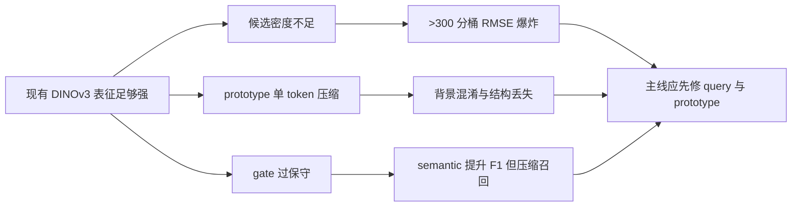
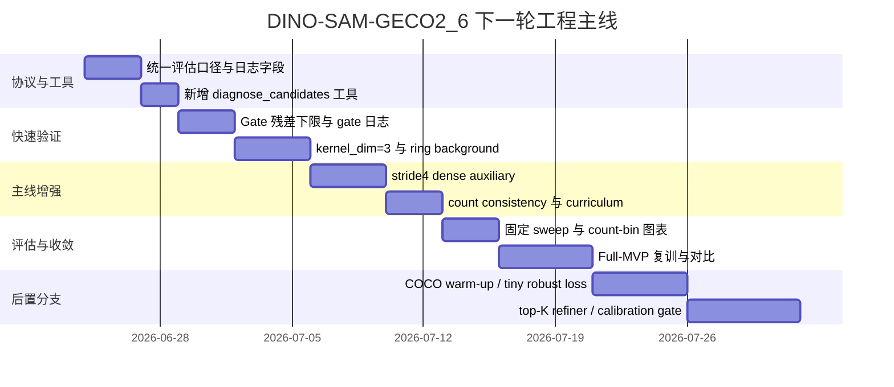

# DINO-SAM-GECO2_6 稳定超越 GECO2 的工程化改进路线

## Executive Summary

你当前的 DINO-SAM-GECO2_6 并不是“语义不够强”，而是**高密度场景的候选生成密度、prototype 表示质量、以及 gate 注入强度**三者之间失衡：检测性指标提升了，但计数误差没有同步收敛。你本地最强计数基线仍然是 P3 的验证集 **MAE/RMSE = 21.21/48.88**，而 stride=8 + semantic anchor 虽然把 **F1@IoU50 推到约 0.5085**，验证集 **RMSE 仍升到约 60.66**；同时，P3A 的 **pre-NMS/GT 从 1.34 降到 1.03**，在 **>300** 分桶里 **pre_nms_per_gt 仅约 0.756**，且 NMS keep ratio 接近 1，说明主瓶颈发生在 **NMS 之前**。fileciteturn0file6

因此，下一轮主线不应继续优先“换更大 backbone”或“继续堆后处理”，而应将改造顺序固定为：**先统一协议与诊断，再救候选密度，再修 prototype，再放宽 gate**。这一路线与 GECO2 对高分辨率 dense query 的强调、DINOv3 对高质量 dense features 的定位、MAFEA 对 background token 和早期 target awareness 的结论、以及 RT-DETRv3 / DEIM 对训练期 dense positive supervision 的经验是一致的。fileciteturn0file4turn0file1 citeturn0academia1turn0academia2turn0academia0turn2academia1turn1academia2

我建议把“稳定超过 GECO2”的实现目标改写成一个更可执行的判据：**在固定后处理协议下，把 >300 分桶的 pre_nms_per_gt 拉回到 ≥0.90、把总体 RMSE 降到 <48、同时维持 F1@IoU50 不低于当前 semantic 版本的 98%**。这比单看某个 checkpoint 的 F1 或某次 sweep 的最优 RMSE，更接近真正可复现、可合并的工程成功。fileciteturn0file4turn0file6

## 现状判断与瓶颈排序

你当前模型的主链条已经具备较强的表示上限：`DINOv3Adapter` 提供冻结的 DINOv3 dense features 与 CNN spatial prior，`QueryGenerator` 通过 prototype attention 与 MSDeformAttn 做 exemplar-conditioned query 生成，`ScaleAwareQueryAggregator` 再用 spatial gate + channel gate 做逐层融合，最后用轻量检测头输出 centerness/objectness 与 bbox。当前代码还已经具备 semantic anchor 链路、detection-aware checkpointing、zero-IoU fallback matcher 与 center neighborhood supervision，这说明问题的重心已经从“能不能训起来”转成“哪里在限制候选与计数”。fileciteturn0file4turn0file6

从你上传的结果看，最关键的事实有四个。其一，P3 仍是当前最可信计数基线，验证集 **MAE/RMSE = 21.21/48.88**；其二，postprocess sweep 虽然可把 RMSE 推到 **48.60**，但提升幅度有限，说明后处理不是根因；其三，`query_output_stride=8` 的 2026-06-18 run 计数显著退化到 **MAE/RMSE = 24.30/66.37**；其四，加入 semantic anchor 后，**F1@IoU50 提升到约 0.5085**，但 **RMSE 仍约 60.66**，即“更会挑框，但不更会数数”。fileciteturn0file4turn0file6

更重要的是，P3 对比 P3A/semantic 的候选诊断已经把因果链条暴露得很清楚：整体 **Pre-NMS / GT 从 1.34 降到 1.03**，**Post-NMS / GT 从 0.98 降到 0.92**，但分数均值反而从 **0.168 升到 0.310**，有效阈值也从 **0.367 升到 0.419**。这说明 semantic/gate 让候选“更干净”，却把候选“压少了”；尤其在 **>300** 分桶里，**pre_nms_per_gt = 0.756**、**post_nms_per_gt = 0.756**，几乎没有被 NMS 再砍掉，证明真正的问题是**候选在进 NMS 之前就已经不够**。fileciteturn0file6

从工程优先级上看，我建议把瓶颈重新排序为下面三项。第一项是**候选生成密度不足**，对应 P0；第二项是**prototype 表示被压缩，空间结构与背景对抗不足**，对应 P1；第三项是**ScaleFusionBlock 的 gate 过于保守，尤其在 dense regime 下把高层语义注入低层细节的力度压低了**，对应 P2。你上传的第六版建议文档其实已经给出了相同方向：先统一协议，再做 semantic-anchor 完整训练与验证 sweep，然后才进入 top-K refiner 和 count-bin calibration，而不是直接继续押注 stride=8 或更大 backbone。fileciteturn0file4



### 候选生成密度不足

这是当前最重要的瓶颈。你的内部结果已经说明：当 query 输出做成 stride=8、而 semantic/gate 让得分更集中时，低计数图误检下降，但高计数图候选在 NMS 前就已经不足，导致 RMSE 由少量极端 dense 样本主导。GECO2 的核心恰恰是通过 gradual query aggregation 构建高分辨率 dense query map，以覆盖大小目标和高密度小目标；也就是说，你现在输给 GECO2 的不是 backbone，而是**没有把 DINOv3 的 dense feature 优势充分兑现成高分辨率候选密度**。fileciteturn0file6turn0file1 citeturn0academia1turn0academia2

### Prototype 表示被压缩

当前 `kernel_dim=1`，意味着 exemplar 在每个尺度上通常只有 1 个视觉 token，加上 9D geometry 后再拼为 prototype embedding。这个设计简洁，但对重复纹理、形状结构、多实例干扰的保留明显不足；你上传的路线图已经明确建议把 `kernel_dim` 从 1 改到 3，并加入 ring ROI background token。TMR 与 SSD 都指出，**spatially collapsed prototype 会丢掉空间结构**，而 MAFEA 进一步说明，如果背景没有显式建模，query/exemplar 交互就会更容易出现 target confusion。fileciteturn0file6turn0file1 citeturn7academia0turn0academia3turn0academia0

### Gate 过于保守

你当前已经从 GECO2 的 `up + add` 走到了条件门控融合，这个方向本身是对的；问题不是“要不要 gate”，而是“gate 要不要按密度自适应、要不要有残差下限、要不要显式约束在 dense regime 下别把高层语义关死”。内部结果里，semantic anchor 版本表现出**分数更高、阈值更高、候选更少**的组合模式；这高度符合“gate 更保守，改善 precision 但伤 recall”的现象。RT-DETRv4 强调语义注入强度应可调，RT-DETRv3 / DEIM 则说明 Hungarian 架构下需要更密的训练正样本来避免监督过稀。你当前的 P2 问题，本质上是这两者的组合：融合强度保守，而训练信号又不足以逼它在 dense regime 放开。fileciteturn0file6turn0file1 citeturn2academia3turn2academia1turn1academia2

## 诊断协议与脚本设计

在做任何结构修改前，必须先把诊断协议固定下来。你上传的第六版建议已经明确提出：所有 `val/test` 评估都应落盘 `summary.json`、`summary_by_count_bin.csv`、`top_abs_errors.csv`、`per_image_predictions.jsonl`、`coco_metrics.json` 和 `selection_report.json`，并把 `score_threshold`、`score_ratio`、`nms_method`、`nms_iou`、`verification_mode` 等一起写入结果。否则，你在比较的往往不是模型，而是不同后处理口径。fileciteturn0file4

我建议新增一套固定的“六元诊断面板”。其一是 **MAE / RMSE**；其二是 **F1@IoU50 / AP50**；其三是 **pre_nms_per_gt / post_nms_per_gt**；其四是 **candidate_recall@0.5_preNMS**；其五是 **recall@stride**；其六是 **count-bin signed error**。这六项里，前两项回答“会不会检”和“会不会数”，第三与第四回答“候选是不是在 NMS 前就死掉了”，第五回答“是不是 stride 本身太粗”，第六回答“究竟是低计数过检还是高计数欠检”。这正好对齐你目前暴露出来的系统性误差模式。fileciteturn0file4turn0file6

### 建议增加的 metric 定义

下面这些 metric 建议直接作为统一日志字段落盘。

```python
def compute_candidate_metrics(gt_boxes, pre_boxes, post_boxes, stride_peaks=None, iou_thr=0.5):
    n_gt = max(len(gt_boxes), 1)

    pre_nms_per_gt = len(pre_boxes) / n_gt
    post_nms_per_gt = len(post_boxes) / n_gt

    # 每个 GT 是否在 pre-NMS 阶段已有至少一个候选覆盖
    pre_hit = []
    for gt in gt_boxes:
        pre_hit.append(any(iou(p, gt) >= iou_thr for p in pre_boxes))
    candidate_recall_pre = sum(pre_hit) / n_gt

    # 诊断 stride 分辨率是否限制中心可达性
    # stride_peaks: [(x, y, score), ...] on stride-s map
    stride_hit = []
    for gt in gt_boxes:
        cx, cy = box_center(gt)
        radius = max(2.0, 0.15 * (box_area(gt) ** 0.5))
        stride_hit.append(any(dist((x, y), (cx, cy)) <= radius for x, y, _ in stride_peaks))
    recall_at_stride = sum(stride_hit) / n_gt

    return {
        "pre_nms_per_gt": pre_nms_per_gt,
        "post_nms_per_gt": post_nms_per_gt,
        "candidate_recall_pre": candidate_recall_pre,
        "recall_at_stride": recall_at_stride,
    }
```

这段伪代码的意义在于，把“候选不够”与“box 不准”分离开。尤其在你现在的系统里，`>300` 分桶的 `pre_nms_per_gt` 已经明显偏低，所以必须优先看 `candidate_recall_pre` 与 `recall_at_stride`，而不是只盯最终 NMS 后的 count。fileciteturn0file6

### 建议新增的 gate 与 prototype 诊断

对于你特别关心的 prototype 与 gate，我建议再加三组辅助统计：**alpha_mean_by_level**、**alpha_hist_by_count_bin**、**proto_pos_bg_margin**。前两者回答 gate 在不同密度下是否把高层语义“关死”；后者回答 prototype 能否把正样本与 ring-background 拉开。MAFEA 的 background token 与判别损失、TMR/SSD 对空间结构 prototype 的讨论，都说明如果不做这一步，你会很难知道 P1/P2 改动究竟是“没用”，还是“根本没被正确激活”。citeturn0academia0turn7academia0turn0academia3

```python
# 在 ScaleFusionBlock.forward() 中记录
log_dict["alpha_l2_mean"] = alpha_l2.mean().item()
log_dict["alpha_l1_mean"] = alpha_l1.mean().item()

# 在验证时按 count-bin 聚合
bin_stats[count_bin].append({
    "alpha_l2_mean": alpha_l2.mean().item(),
    "alpha_l1_mean": alpha_l1.mean().item(),
    "proto_pos_bg_margin": (sim_pos.mean() - sim_bg.mean()).item(),
})
```

### 建议的命令行流程

假设你继续沿用当前训练脚本，我建议把实验流程固定成三步：训练、标准评估、候选/后处理诊断。

```bash
# 训练
python train.py \
  --config configs/p3a_semantic.yaml \
  --experiment_name p3a_gate_diag \
  --save_all_selection_reports \
  --save_val_predictions

# 固定口径评估
python tools/eval_checkpoint.py \
  --checkpoint outputs/checkpoints/p3a_gate_diag/best_val_rmse.pth \
  --split val \
  --score_threshold 0.25 \
  --score_ratio 0.50 \
  --nms_method hard \
  --nms_iou 0.30 \
  --save_dir outputs/eval_runs/p3a_gate_diag_val

# 候选与 gate 诊断
python tools/diagnose_candidates.py \
  --pred_json outputs/eval_runs/p3a_gate_diag_val/per_image_predictions.jsonl \
  --gt_json data/fsc147/val_annotations.json \
  --save_dir outputs/diagnostics/p3a_gate_diag_val
```

如果 `tools/diagnose_candidates.py` 还不存在，我建议把它作为本轮第一个新增工具脚本；因为当前所有主判断都依赖它。fileciteturn0file4turn0file6

## 分瓶颈改进方案

### 候选生成密度不足

针对这项瓶颈，我建议优先做四类改造，而且顺序应该是“先低风险增密，再中风险高分辨率，再训练期密监督，最后做局部 refine”。

#### 方案组一

**改动点**：`src/models/scale_query_aggregator.py`、`src/models/DGECO.py`、`src/utils/losses.py`。  
**核心思路**：保留 stride=8 主头，同时增加 stride=4 支路，但第一轮建议把 stride=4 设计成**训练期强监督 + 推理期可选融合**，而不是一上来就把全量推理都切到高分辨率。你上传的路线图已经明确提出“stride8 semantic + stride4 dense”的双输出头，这是最直接对齐 GECO2 高分辨率 dense query 优势的一步。GECO2 的核心贡献就是 gradual aggregation 形成高分辨率 dense queries；RT-DETRv3 也证明训练期 dense positive supervision 能在不增加推理延迟的情况下提升稀疏匹配架构。fileciteturn0file1 citeturn0academia1turn2academia1

```python
# scale_query_aggregator.py
q8 = self.out_stride8(q2)        # H/8
q4 = self.out_stride4(q1)        # H/4

# DGECO.py
cls8, box8 = self.head8(q8)
cls4, box4 = self.head4(q4)

# losses.py
heat4 = gaussian_target(gt_centers, stride=4, sigma="area_adaptive")
loss_dense4 = focal_bce(sigmoid(cls4_aux), heat4)

count8 = soft_count(sigmoid(cls8), box8)
count4 = soft_count(sigmoid(cls4), box4)
loss_count = huber(0.5 * count8 + 0.5 * count4 - gt_count)

loss_total += 0.20 * loss_dense4 + 0.25 * loss_count
```

**预期影响**：最直接的目标是把 `>300` 分桶的 `pre_nms_per_gt` 从约 0.756 拉回到 ≥0.90，把总体 RMSE 拉回 P3 水平以下，同时不把低计数误检完全放开。  
**潜在风险**：显存增加明显，低计数 FP 可能回升。  
**回退策略**：保留 stride=4 为训练期 auxiliary，只输出 stride=8；或者只在 dense region 启用 stride=4。  
**优先级**：最高。  
**估计成本**：开发 10–14 小时；单卡 A100 40GB 训练 16–28 GPU-hours。  

#### 方案组二

**改动点**：`src/models/scale_query_aggregator.py`、`src/models/DGECO.py`、新增 `src/utils/window_refine.py`。  
**核心思路**：做 **density-triggered local refinement**。先让 `q3` 或 `q2` 产生一个轻量 `density_token`，再对 top-K 高密度区域单独跑局部 stride=4 refine，而不是全图高分辨率。你上传的路线图已经给出了类似建议：默认 only stride=8，当 `density_token > τ` 时对 top-K 区域跑局部 stride=4 refine。这个方向与 GECO2 对 dense scenes 的关注是一致的，也比直接全图高分辨率更节省显存。fileciteturn0file1 citeturn0academia1

```python
density_token = self.density_head(self.gap(q3))   # [B, d]
dense_score = self.density_cls(density_token)     # sparse / medium / dense

if dense_score.argmax(-1) == DENSE:
    windows = select_topk_windows(sigmoid(cls8), k=8, window=128)
    refine_logits, refine_boxes = self.local_refiner(q1, windows)
```

**预期影响**：相比全图双 stride，更可能在显存可控的前提下提升 dense tail recall。  
**潜在风险**：路由失败会漏掉 dense 区域。  
**回退策略**：先只做验证期局部 refine；训练保持原主链。  
**优先级**：高。  
**估计成本**：开发 12–16 小时；训练 12–20 GPU-hours。  

#### 方案组三

**改动点**：`src/models/matcher.py`、`src/utils/losses.py`、`train.py`。  
**核心思路**：增加 **training-only dense positive supervision**，可以先不上 matcher 大改，只在 stride=4/8 辅助分支加 dense point/peak supervision；第二步再考虑 DEIM 风格 Dense O2O 或 Matchability-Aware Loss。RT-DETRv3 和 DEIM 的共同经验是：在 Hungarian 一对一匹配架构下，训练期正样本过稀会导致 recall 与收敛都受限，而 dense auxiliary 是低风险补药。citeturn2academia1turn1academia2

```python
# 第一轮：不改 matcher，仅加 dense auxiliary
loss_total += 0.20 * dense_peak_loss(aux_peak_map, gt_peak_map)

# 第二轮：DEIM 风格
extra_matches = dense_o2o_assign(pred_boxes, gt_boxes, radius=2, iou_low=0.2)
loss_total += 0.10 * matchability_aware_loss(extra_matches)
```

**预期影响**：更快把 pre-NMS 候选抬起来，同时改善收敛速度。  
**潜在风险**：若额外正样本质量低，可能引入噪声。  
**回退策略**：先只保留 dense peak head，不动 matcher。  
**优先级**：高。  
**估计成本**：开发 8–12 小时；训练 18–30 GPU-hours。  

#### 方案组四

**改动点**：`src/datasets/*` 采样器、`src/utils/postprocess.py`、`tools/sweep_postprocess.py`。  
**核心思路**：补上 **count-bin curriculum + density-aware postprocess**。这不是根治候选的结构改造，但很适合和上面三个主方案配套：训练时提升 `>300` 分桶抽样倍率 2–4 倍；推理时对 dense regime 适度下调 `score_threshold`、提升 `nms_iou` 或改 `dense_soft`。你上传的第六版建议文档已经明确支持这一路线，但也强调它不应替代主结构修复。fileciteturn0file4turn0file1

```python
# sampler
bin_id = count_to_bin(len(gt_boxes))
sample_weight = { "7-20":1.0, "20-50":1.0, "50-100":1.2, "100-300":1.8, ">300":3.0 }[bin_id]

# postprocess
if predicted_regime == "dense":
    score_threshold *= 0.85
    nms_iou = min(0.40, nms_iou + 0.05)
```

**预期影响**：能更快改善 long-tail 稳定性。  
**潜在风险**：dense 上去后，low-count 可能过检。  
**回退策略**：课程采样先在前 50% epoch 使用，后半程退火回原分布。  
**优先级**：中高。  
**估计成本**：开发 4–6 小时；训练额外成本很低。  

### Prototype 表示被压缩

这项瓶颈是你当前第二重要的结构问题。这里我建议做四个改造，其中前两个最值得优先落地。

#### 方案组一

**改动点**：`src/models/DGECO.py`、`src/models/query_generator.py`、若无则新建 `src/models/proto_encoder.py`。  
**核心思路**：把 `kernel_dim=1` 提升到 `kernel_dim=3`，让每个 exemplar 在每个尺度产生 `3×3=9` 个 token，再用一个极轻的 self-attention / pooling 编成 prototype set，而不是直接 spatial collapse。你上传的路线图第一页和中间页已经把这条列为最高优先级之一；TMR 与 SSD 也都指出，保留 exemplar 的空间结构对 few-shot pattern matching 非常关键。fileciteturn0file1turn0file6 citeturn7academia0turn0academia3

```python
roi_pos = roi_align(feat_l, boxes, output_size=(3, 3))        # [M, C, 3, 3]
pos_tokens = roi_pos.flatten(2).transpose(1, 2)               # [M, 9, C]

proto_tokens = self.proto_encoder(
    pos_tokens=pos_tokens,
    geom_token=self.geom_proj(geom_feat)
)   # [M, K, C], K 可先取 4 或 8
```

**预期影响**：对 dense recall、框尺度稳定性、以及相似纹理目标的区分通常都会有正收益。  
**潜在风险**：prototype-attention FLOPs 上升。  
**回退策略**：只在 `c1/c2` 开多 token，在 `c3` 仍保留 pooled。  
**优先级**：最高。  
**估计成本**：开发 8–12 小时；训练 14–24 GPU-hours。  

#### 方案组二

**改动点**：`src/models/DGECO.py`、`src/models/query_generator.py`、`src/utils/losses.py`。  
**核心思路**：加入 **ring ROI background token** 与 **target-background discrimination loss**。做法是对 exemplar box 外扩 1.5×，减去原 box，得到环形背景区域；然后并行提取 `bg_tokens`，让 query 在与 `pos_proto` 匹配的同时，也显式远离 `bg_proto`。这一步与你特别关心的“background 对抗”完全对齐，也和 MAFEA 的结论一致。fileciteturn0file1 citeturn0academia0

```python
roi_bg = ring_roi_align(feat_l, boxes, output_size=(3, 3), expand=1.5)
bg_tokens = roi_bg.flatten(2).transpose(1, 2)

sim_pos = cosine_sim(query_tokens, pos_proto)
sim_bg  = cosine_sim(query_tokens, bg_proto)

loss_tbd = F.relu(margin - sim_pos + sim_bg).mean()
loss_total += 0.10 * loss_tbd
```

**预期影响**：最明显的收益通常落在低计数误检与多类干扰场景。  
**潜在风险**：早期训练可能因为 hard negative 太强而不稳。  
**回退策略**：前 10 epoch 不启用 background loss，或对 `bg_proto` 停梯度。  
**优先级**：高。  
**估计成本**：开发 6–10 小时；训练 12–20 GPU-hours。  

#### 方案组三

**改动点**：`src/models/query_generator.py`、新增 `src/models/prototype_bank.py`。  
**核心思路**：从单原型改成 **multi-anchor prototypes + EMA bank**。第一阶段只用 exemplars 产生 K 个 prototype；第二阶段再把 matched high-confidence query features 用 EMA 写回 bank。CountZES 的启发点不在“零样本”，而在于**多样、互补的 exemplar set**更稳；这与你当前 few-shot counting 的 prototype 覆盖问题是同一类矛盾。citeturn3academia0

```python
# 初始化
proto_bank = init_from_exemplar_tokens(pos_tokens, k=4)

# 训练中 EMA 更新
if score > 0.7 and iou_to_gt > 0.5:
    proto_bank[level][slot] = 0.95 * proto_bank[level][slot] + 0.05 * query_feat.detach()
```

**预期影响**：更适合应对 intra-class variance、尺度变化和可见性变化。  
**潜在风险**：bank 漂移。  
**回退策略**：先禁用 EMA，只保留 static K prototypes。  
**优先级**：中高。  
**估计成本**：开发 10–14 小时；训练 16–26 GPU-hours。  

#### 方案组四

**改动点**：`src/models/DGECO.py`、`src/models/query_generator.py`、`src/utils/losses.py`。  
**核心思路**：将 prototype 明确拆分为 **proto_sem** 与 **proto_geo** 两条支路；`class_embed` 主要看 `proto_sem` 与 semantic anchor，`bbox_embed` 主要看 `proto_geo`、Fourier geometry 与 per-scale modulation。你当前已经有 9D geometry，路线图也建议进一步做 Fourier geometry encoding 和 per-scale modulation；这一步可以降低“语义分支越强，几何回归越保守”的冲突。fileciteturn0file1 citeturn7academia1turn3academia2

```python
geo_fourier = fourier_encode([log_w, log_h, log_area, aspect], num_freqs=8)   # 64D
proto_sem = self.proto_sem_encoder(pos_tokens, anchor_token)
proto_geo = self.proto_geo_encoder(pos_tokens, geo_fourier)

cls_feat = fuse_cls(query_feat, proto_sem)
box_feat = fuse_box(query_feat, proto_geo)
```

**预期影响**：更容易同时保住 F1 和 RMSE。  
**潜在风险**：结构复杂度上升。  
**回退策略**：先共享前半段编码器，只在 heads 前分流。  
**优先级**：中高。  
**估计成本**：开发 8–12 小时；训练 12–22 GPU-hours。  

### Gate 过于保守

这是当前最适合快修、快验证的一组改法。因为它们大多不需要重写主干，且能直接回应“semantic 版本 F1 上升但 RMSE 恶化”的现象。

#### 方案组一

**改动点**：`src/models/scale_query_aggregator.py`。  
**核心思路**：给 gate 加 **残差下限** 与 **温度系数**。最简单有效的做法，是把当前 `alpha = sigmoid(g)` 改成  
`alpha = alpha_min + (1 - alpha_min) * sigmoid(g / tau)`，并按 density 使用不同的 `alpha_min`。你上传的路线图也直接给出了类似公式，建议 `alpha_min=0.10~0.20`。这几乎是最低成本的“先救召回”手段。fileciteturn0file1

```python
def gate(g, alpha_min=0.15, tau=1.5):
    return alpha_min + (1.0 - alpha_min) * torch.sigmoid(g / tau)
```

**预期影响**：高计数场景最先受益；一般会先体现在 `pre_nms_per_gt` 与 `candidate_recall_pre` 上。  
**潜在风险**：低计数 FP 略增。  
**回退策略**：把 `alpha_min` 仅用于 dense bin，sparse bin 保持原 gate。  
**优先级**：最高。  
**估计成本**：开发 2–4 小时；训练 8–12 GPU-hours。  

#### 方案组二

**改动点**：`src/models/scale_query_aggregator.py`。  
**核心思路**：把 `density_token`、`pos_anchor`、`bg_token` 一起送入 gate context，做 **density-aware gate**，而不是只依赖单一路径 semantic anchor。你的路线图已经明确建议把 gate context 从“单 semantic anchor”扩成三路；RT-DETRv4 对自适应语义注入强度的强调，也支持这一方向。fileciteturn0file1 citeturn2academia3

```python
density_token = self.density_head(self.gap(q3))
ctx2 = torch.cat([pos_anchor, bg_token, density_token], dim=-1)
ctx1 = torch.cat([pos_anchor, bg_token, density_token], dim=-1)

q2 = self.fuse_c2(up_q3, q2, ctx2)
q1 = self.fuse_c1(up_q2, q1, ctx1)
```

**预期影响**：能减少“semantic anchor 提 F1 但压召回”的副作用。  
**潜在风险**：context 维度增大后需要重新调归一化与 MLP。  
**回退策略**：先只加 `density_token`，不同时引入 `bg_token`。  
**优先级**：高。  
**估计成本**：开发 6–8 小时；训练 10–16 GPU-hours。  

#### 方案组三

**改动点**：`src/models/scale_query_aggregator.py`、`train.py`、新增 gate regularizer。  
**核心思路**：加入 **gate regularization** 与 **per-bin gate logging**。目标不是把 alpha 固定成同一个值，而是让 dense bin 不要明显低于某个安全下限。例如，在 `>300` bin 里要求 `alpha_l1_mean >= 0.22`、`alpha_l2_mean >= 0.18`，低于时给一个轻度惩罚。这样你就能把“gate 太保守”从猜测变成可监控的训练对象。fileciteturn0file4turn0file1

```python
target_alpha = {"sparse": 0.10, "medium": 0.15, "dense": 0.22}[pred_regime]
loss_gate = F.relu(target_alpha - alpha.mean()).mean()
loss_total += 0.02 * loss_gate
```

**预期影响**：实验更可控，ablation 更容易解释。  
**潜在风险**：过度约束可能损害 precision。  
**回退策略**：只做 logging，不上 loss。  
**优先级**：中高。  
**估计成本**：开发 4–6 小时；训练 8–14 GPU-hours。  

#### 方案组四

**改动点**：`src/models/scale_query_aggregator.py`。  
**核心思路**：增加 **轻量 bidirectional fusion**，在现有 `q3 -> q2 -> q1` 后，再用 `q1 -> q2` 反哺一轮中层 refine。你上传的路线图已经给出这一伪代码。其价值在于让高分辨率细节不仅被动接收语义，也能反过来修正中层尺度和位置估计，这通常对小目标定位特别有帮助。fileciteturn0file1

```python
q2_td = self.fuse_c2(self.up_c3_to_c2(q3), q2, ctx2)
q1_td = self.fuse_c1(self.up_c2_to_c1(q2_td), q1, ctx1)
q2_bu = self.down_c1_to_c2(q1_td)
q2 = q2_td + self.refine_c2(q2_bu, q2_td, ctx2)
```

**预期影响**：提升小目标和中密度场景的 box 稳定性。  
**潜在风险**：层间耦合更强，训练更敏感。  
**回退策略**：第二轮再加，只在 P0/P1 收益明确后使用。  
**优先级**：中。  
**估计成本**：开发 8–12 小时；训练 12–20 GPU-hours。  

### 跨瓶颈但建议后置的增强项

有两条不是当前主线，但值得保留。第一条是你第六版文档提出的 **COCO class-agnostic adapter warm-up**：因为 DINOv3 本身强调 dense features 质量，检测式 few-shot counting 也确实受益于 objectness/localization 先验，所以把 COCO 折叠为前景类来预热 adapter 是合理的；但它更可能先提升 AP/F1，而未必直接解决 dense counting，所以建议放在主线稳定之后做独立消融。第二条是 **tiny-object robust localization**：如果你的 benchmark 含有大量 tiny/密集 box，NWD 与 TOLF 对“小框对 IoU 极敏感”和“标注噪声过拟合”的分析很有指导意义，可以考虑把 NWD/GCD 类度量用于 matcher 或 NMS，把 uncertainty weighting 用在 bbox loss 上，但应放到第二阶段，而不是与主干改造同时上。fileciteturn0file4 citeturn0academia2turn2academia0turn1academia1turn1academia0turn1academia3

## 对比实验矩阵与可视化

实验不建议一次性堆满。你上传的路线图已经给出一个非常正确的顺序：**先救 dense recall，再修 prototype，最后把监督从“框对”扩成“框对 + 数对 + 背景对”**。我建议把这套思路落实成下面这张表，统一训练集、验证集和日志字段。当前假设沿用你项目默认数据划分与单卡 A100 40GB。fileciteturn0file1turn0file4

| 实验名 | 训练配置 | 关键改动 | 关键超参 | 评估集 | 预期变化 | 评估时间点 |
|---|---|---|---|---|---|---|
| Baseline-P3 | 当前最强 P3 | 无 | 按现配置 | 默认 val/test | 作为 count 基线 RMSE≈48.88 | epoch 20/40/60/80/last |
| Gate-Rescue | P3 + gate 残差下限 | `alpha_min=0.15, tau=1.5` | dense bin `alpha_min=0.20` | val | `pre_nms_per_gt` 上升，RMSE 下降 2–4% | epoch 10/20/40/60 |
| Gate-Density | Gate-Rescue + density token | context 加 `density_token` | density cls 3 bins | val | `>300` bin recall 上升 | epoch 20/40/60/80 |
| Proto-9Tok | Gate-Rescue + `kernel_dim=3` | exemplar 多 token | K=4 prototypes | val/test | F1 上升且 RMSE 不恶化 | epoch 20/40/60/80 |
| Proto-BG | Proto-9Tok + ring background | `loss_tbd=0.10` | expand=1.5 | val/test | 低计数 FP 降，F1 稳定 | epoch 20/40/60/80 |
| Dual-Stride | Gate-Rescue + stride4 aux | dense peak + count consistency | `λ_dense=0.20, λ_count=0.25` | val/test | `>300` bin pre_nms_per_gt ≥0.90 | epoch 20/40/60/80 |
| Dense-Sup | Dual-Stride + dense positive aux | 训练期 dense peak | radius=2 / sigma adaptive | val | 收敛更快，候选更足 | epoch 10/20/40/60 |
| Full-MVP | Gate + Proto + Dual-Stride | 三者组合 | 保守起步 | val/test | RMSE < 48 且 F1 不低于 semantic 版 98% | epoch 20/40/60/80 |
| Warmup-COCO | Full-MVP + adapter warm-up | 仅 adapter 预热 | COCO class-agnostic | val/test | AP/F1 稳中有升 | warm-up 后 + 40/80 epoch |
| Tiny-Robust | Full-MVP + NWD/TOLF-style | matcher/loss 调整 | `λ_uncert=0.05~0.1` | val/test | tiny / dense scene 更稳 | 第二阶段单独测 |

推荐在所有实验中都固定同时输出以下图表。因为你当前的问题不是“少 0.3 个 MAE”，而是**误差结构**。

**图一：`recall vs count-bin`**  
横轴为 count-bin，纵轴为 `candidate_recall_pre` 与 `post_nms_recall` 两条线。该图最能直接判断“到底是候选问题还是 NMS 问题”。当前内部证据已经表明，P3A 在 `>300` bin 的主问题是 pre-NMS 候选不足。fileciteturn0file6

**图二：`pre_nms_per_gt` 直方图**  
按 count-bin 分色，用于看候选生成密度分布是否整体右移。若结构改动有效，应看到高计数 bin 的直方图均值明显上移。fileciteturn0file4turn0file6

**图三：`RMSE vs stride`**  
横轴为 stride 配置（8 / 8+4aux / local refine / full dual），纵轴为 RMSE，同时标注 F1@IoU50。该图用于防止再次落入“F1 提升但 RMSE 退化”的陷阱。fileciteturn0file6

**图四：`gate alpha vs count-bin`**  
显示 `alpha_l1_mean` 与 `alpha_l2_mean` 在各分桶的箱线图。若 `>300` 分桶显著更低，则 P2 被验证。fileciteturn0file1

下面给一个你可以直接落地的 matplotlib 绘图骨架：

```python
import pandas as pd
import matplotlib.pyplot as plt

df = pd.read_csv("summary_by_count_bin.csv")

plt.figure()
plt.plot(df["count_bin"], df["candidate_recall_pre"], marker="o", label="pre-NMS recall")
plt.plot(df["count_bin"], df["candidate_recall_post"], marker="o", label="post-NMS recall")
plt.xlabel("count-bin")
plt.ylabel("recall")
plt.legend()
plt.title("Recall vs count-bin")
plt.savefig("recall_vs_count_bin.png", dpi=200)

plt.figure()
plt.bar(df["count_bin"], df["pre_nms_per_gt"])
plt.xlabel("count-bin")
plt.ylabel("pre_nms_per_gt")
plt.title("Candidate density by count-bin")
plt.savefig("pre_nms_per_gt.png", dpi=200)
```

### 最小可行实验清单

如果你希望先做一轮**最小代价、最高信息量**的实验，我建议只做下面三个。

**第一个 MVP** 是 **gate 残差下限 + gate 日志**。  
成功判定标准：`>300` 分桶 `pre_nms_per_gt` 至少提升 0.08，总体 RMSE 下降 ≥2%，且 F1@IoU50 不下降超过 1%。  
后续扩展路径：若有效，再加 density-aware gate；若无效，说明主问题更偏向 prototype 或 stride。fileciteturn0file1turn0file6

**第二个 MVP** 是 **`kernel_dim=3` + ring background token**。  
成功判定标准：低计数分桶 signed error 收敛，F1@IoU50 提升 ≥1 点，同时 RMSE 不恶化。  
后续扩展路径：若有效，再上 multi-anchor prototype bank；若无效，说明单 exemplar token 不是主矛盾。fileciteturn0file1turn0file6 citeturn7academia0turn0academia0

**第三个 MVP** 是 **stride=4 dense auxiliary + count consistency**。  
成功判定标准：`candidate_recall_pre` 和 `recall@stride` 同时提升，`>300` 分桶 RMSE 明显回落，且验证集总体 RMSE 低于 P3。  
后续扩展路径：若有效，再决定是上 full dual-stride 还是 density-triggered local refine。fileciteturn0file1turn0file6 citeturn2academia1turn1academia2

## 实施时间线、风险监控与合并清单

从你当前代码状态出发，我建议按下面的节奏推进，而不是并行铺太多分支。原因很简单：你现在最需要的是**可解释的 ablation**，而不是更多尚未解耦的变量。上传的第六版建议也明确强调：先做协议统一与状态核对，再做 semantic-anchor 完整训练与有效 sweep，然后才进入更重的 top-K refiner、count-bin calibration、SAM3、ConvNeXt 或优化器消融。fileciteturn0file4



### 风险与监控指标清单

你当前最需要盯住的，不是单一 RMSE，而是一个小型 dashboard。

**必须实时监控的训练指标** 包括：`val_mae`、`val_rmse`、`val_f1_iou50`、`val_ap50_iou50`、`val_preds_per_gt`、`pre_nms_per_gt`、`candidate_recall_pre`、`alpha_l1_mean`、`alpha_l2_mean`、`proto_pos_bg_margin`、以及按 count-bin 的 signed error。你上传的日志已经证明，只看 MAE/RMSE 会掩盖“F1 提升但候选变少”的问题。fileciteturn0file4turn0file6

**高风险信号** 主要有四种。第一，`score_mean` 上升、`effective_threshold` 上升，但 `pre_nms_per_gt` 同时下降；这往往意味着 gate/semantic 在继续收紧。第二，F1 上升而 `>300` 分桶 RMSE 恶化；这说明密集场景召回被牺牲。第三，`proto_pos_bg_margin` 过低；这说明 background token 无法形成有效对抗。第四，dual-stride 分支让低计数 bin 的 signed error 大幅转正；这说明增密过头。fileciteturn0file6turn0file1

### PR 合并检查清单

合并到主分支前，我建议严格执行下面这份 checklist。

- [ ] 代码路径明确：本次变更影响的文件写入 PR 描述，包括 `src/models/DGECO.py`、`src/models/query_generator.py`、`src/models/scale_query_aggregator.py`、`src/utils/losses.py`、`src/models/matcher.py`、`src/utils/postprocess.py`、`train.py`、以及新增工具脚本。  
- [ ] 配置可复现：新增的 config 必须写明 `query_output_stride`、`kernel_dim`、`use_semantic_anchor`、loss 系数、后处理口径。  
- [ ] 评估统一：PR 必须附带 `summary.json`、`summary_by_count_bin.csv`、`top_abs_errors.csv`、`per_image_predictions.jsonl` 与 `selection_report.json`。  
- [ ] 指标过线：`RMSE < 48` 或至少相对 P3 再降 ≥2%，且 `F1@IoU50` 不低于 semantic 版本的 98%，同时 `>300` 分桶 `pre_nms_per_gt ≥ 0.90`。  
- [ ] 可解释图表齐全：至少包含 `recall vs count-bin`、`pre_nms_per_gt histogram`、`RMSE vs stride`、`gate alpha vs count-bin`。  
- [ ] 回退路径准备好：每个开关都能单独关闭，如 `--dual-stride false`、`--use-bg-proto false`、`--gate-alpha-min 0.0`。  
- [ ] 文档同步：README 或实验说明中注明“为什么这轮没有继续放大 backbone / SAM3 / ConvNeXt / RL”。这点非常重要，因为你自己的第六版建议已经明确把这些路线后置了。fileciteturn0file4

## 优先参考资源与改动映射

如果你只看少量资源，我建议按下面这六篇去读，而且每篇都直接映射到当前建议中的某个改动。

**GECO2** 的价值，不在“换成 SAM2/Hiera”，而在**通过 gradual query aggregation 构建高分辨率 dense query map**。这直接映射到你的 **dual-stride / local refine / high-res dense auxiliary**。citeturn0academia1

**DINOv3** 的价值，不在“模型更大”，而在**dense feature 质量高，且通过 Gram anchoring 改善长训练下 dense map 退化**。这映射到“维持 frozen backbone，优先改 task head 和 fusion”，而不是第一时间全量微调 backbone。citeturn0academia2

**MAFEA** 的关键启发有两点：**query/exemplar 应尽量早地相互 aware**，以及**background token 有助于减少 target confusion**。这直接映射到你的 **ring ROI background prototype**，以及后续可选的 early mutual-aware adapter。citeturn0academia0

**TMR** 与 **SSD** 共同说明：**把 exemplar 简单 pool 成单 token 会损失空间结构**，而空间相似分布本身就是计数的重要信号。这直接映射到你的 **`kernel_dim=3`、多 token prototype、soft top-k prototype matching**。citeturn7academia0turn0academia3

**RT-DETRv3** 与 **DEIM** 都明确指出：在 Hungarian one-to-one 框架里，**训练期 dense positive supervision / Dense O2O / Matchability-Aware Loss** 能显著改善监督稀疏问题，而且这些模块可以是训练期专用，不增加部署延迟。这直接映射到你的 **stride4 dense auxiliary、count consistency、dense positive branch**。citeturn2academia1turn1academia2

**NWD** 与 **TOLF** 则解释了为什么 tiny / dense object 的回归会“看起来训练正常，实际上上限受限”：因为小框对 IoU 极其敏感，而标注噪声又更容易导致过拟合。这直接映射到你的 **tiny-object robust matcher / uncertainty-aware bbox weighting / NWD-style similarity for assign or NMS**，但我建议把它放在第二阶段，而不是与主线一起上。citeturn1academia1turn1academia0

综合你上传的代码静态分析、P3 与 P3A 的对比、以及“第六版修改建议”的合理部分，我的最终判断是：**你最有机会稳定超过 GECO2 的组合，不是继续放大 DINOv3，而是“gate 先放宽、prototype 先保结构、query 先补高分辨率候选、训练再补 dense positive 与 count consistency”**。这条路线既对齐你现有代码形态，也最符合最新 few-shot counting / DETR / tiny-object 文献给出的因果链。fileciteturn0file4turn0file1turn0file6 citeturn0academia1turn0academia2turn0academia0turn2academia1turn1academia2turn1academia1